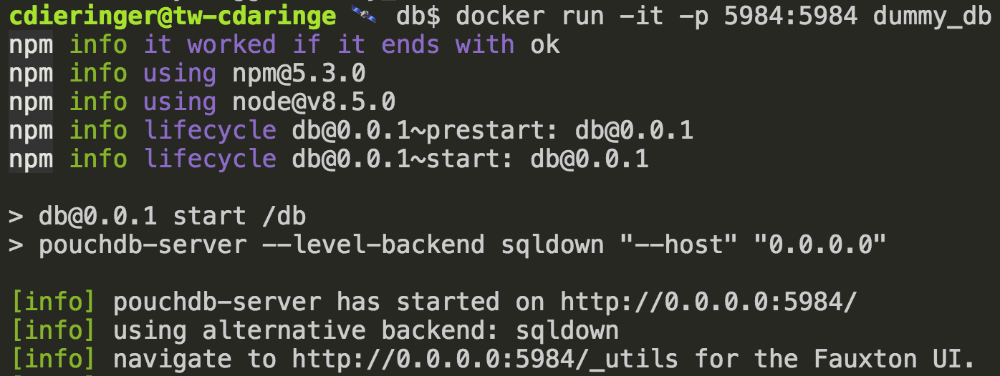
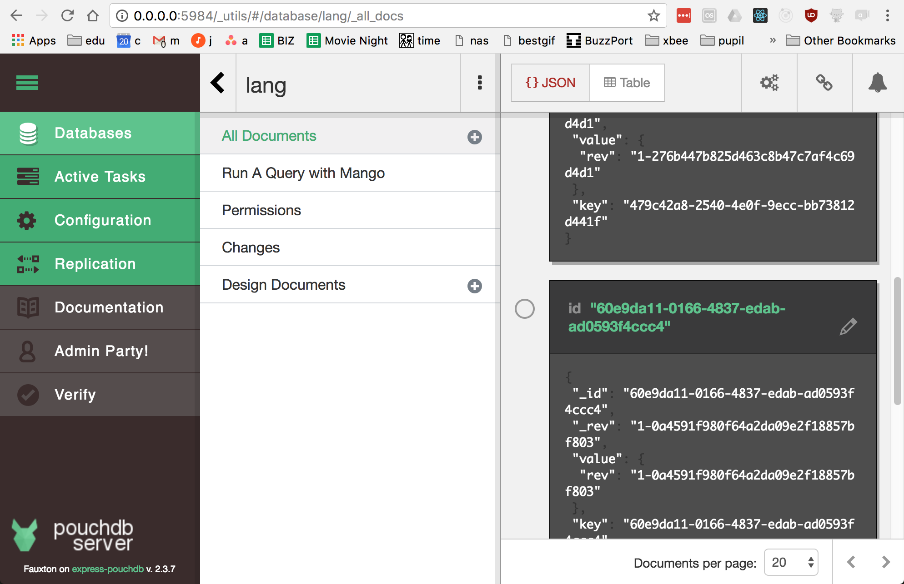

# parallel ui testing with docker

this project shows a recipe for effective parallel end-to-end testing with docker.

the example presented uses a nodejs, react, couchdb/pouchdb, & docker stack.  the intent of the project is not to show or promote any of those tools, except docker.  regardless, i will highlight how some of these tools in this stack ease the game.

## problem

end-to-end (e2e) browser tests often change the supporting backend system state.

this includes, but is not limited to:

- databases
- session managers
- file systems

for instance, if your app has users, hopefull you've written an e2e test to add a user to the system.

however, with the states of these systems dirtied during testing, repeatability is often voided, and browser tests become flaky and/or complicated.

## solution

state resets.

docker makes trashing your old systems and bringing up a new pristine copies _easy_.

## example

we will execute a series of database tests and web application ui tests, where each test get's its own copy of the database.

this project houses:

- a database server image
- a web application
- a suite of e2e tests

let's see how these work together.  the below steps are just to familiarize you with what the example suite _does_, exactly.

### prerequisite

- clone this project
- make sure that the latest version of [nodejs](https://nodejs.org/en/) (8.x+) & [docker](https://www.docker.com/) are installed
- `npm install && npm run bootstrap`

### build the db

the db image is very similar to [couchdb](http://docs.couchdb.org/), but uses an alternate implementation called [pouchdb-server](https://github.com/pouchdb/pouchdb-server).
  - this is strictly because docker **will not commit changes to an image that have declared VOLUMEs**.  couchdb's data directory is in a VOLUME.  there are workarounds, but are more code than I care to share :).

- cd `packages/db`
- `npm run build`
  - this pulls down a base nodejs docker image
  - install pouchdb-server & it's deps
  - runs our hypothetical database migrations against this fresh db instance

- finally, you can run a copy of the db
  - `docker run -it -p 5984:5984 dummy_db`
  - you can see the docs and the "db" we migrated by going to: http://0.0.0.0:5984/_utils/#database/lang/_all_docs

- keep the db running so the UI can use it, momentarily

### launch the UI

- `cd packages/ui`
- `npm start`

this should launch the ui. there are two groups of data:

- data not in the db
- data in the db

clicking any of the submit buttons will add data to the database!  if you want to reset the data, kill the container, re-launch the image, and refresh the page.

## launch the tests

- kill the old ui server
- re-run the ui server, `REACT_APP_NODE_ENV=test npm start`
  - when `'test'` is set, the app [will wait to receive what port the database is hosted on](https://github.com/cdaringe/parallel-ui-testing-with-docker/blob/3a6e6ffcb33e4a65b2871b574dd61a283f2e63df/packages/ui/src/util/globals.js#L23-L28)
- `cd packages/e2e-tests`
- `npm test`
- observe:
  - various docker containers get spun up for each test
  - various tests destructive things to the database, that were the db shared, would break other tests
  - docker containers are stopped and removed on test exit
  - browsers are launched in parallel
    - browser tests wire each browser session to their own database
  - **one of the browser tests intenionally runs a little slowly** so you can open the browser and observe.
    - ideally, you'd run these headlessly, and perhaps wire in some hooks to take screenshots on fail

and blamo!  fast, parallel, repeatable e2e tests.
